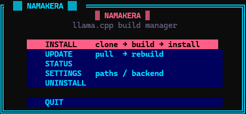

<div align="center">

```
 ███╗   ██╗ █████╗ ███╗   ███╗ █████╗ ██╗  ██╗███████╗██████╗  █████╗
 ████╗  ██║██╔══██╗████╗ ████║██╔══██╗██║ ██╔╝██╔════╝██╔══██╗██╔══██╗
 ██╔██╗ ██║███████║██╔████╔██║███████║█████╔╝ █████╗  ██████╔╝███████║
 ██║╚██╗██║██╔══██║██║╚██╔╝██║██╔══██║██╔═██╗ ██╔══╝  ██╔══██╗██╔══██║
 ██║ ╚████║██║  ██║██║ ╚═╝ ██║██║  ██║██║  ██╗███████╗██║  ██║██║  ██║
 ╚═╝  ╚═══╝╚═╝  ╚═╝╚═╝     ╚═╝╚═╝  ╚═╝╚═╝  ╚═╝╚══════╝╚═╝  ╚═╝╚═╝  ╚═╝
```

**Build, install, and update [llama.cpp](https://github.com/ggerganov/llama.cpp) from source — no flags, just menus.**


</div>

---

## ▓▓ What is this?

A Python TUI app that handles the full lifecycle of llama.cpp — clone, configure, build, install, update, and uninstall — through a cyberpunk-styled interactive interface. No memorizing cmake flags, no hunting for the right options. Jack in and pick what you want.



The TUI steps aside during builds so you can watch live output stream in your terminal, then jacks you back in when it's done.

---

## ▓▓ Features

- **Cyberpunk TUI** — neon cyan borders, hot pink focus highlights, acid yellow prompts
- **Builds from source** — always gets the latest llama.cpp
- **Auto-detects your GPU** — only shows backends available on your machine (CUDA, HIP, Vulkan, OpenBLAS)
- **One-step updates** — confirms, pulls, and rebuilds
- **Settings menu** — change paths and backend without reinstalling
- **Clean uninstall** — removes exactly what CMake installed via the manifest
- **Persistent config** — saves your choices to `~/.config/namakera.conf`

---

## ▓▓ Quick Start

```bash
git clone https://github.com/luxglitch/namakera.git
cd namakera
python3 -m venv .venv
.venv/bin/pip install pytermgui
.venv/bin/python3 namakera.py
```

Hit **INSTALL** and follow the prompts.

---

## ▓▓ Dependencies

### Python

| Package | Purpose |
|---------|---------|
| `pytermgui` | Cyberpunk TUI framework |

Install it in the venv: `.venv/bin/pip install pytermgui`

### System — Required

| Tool | Purpose |
|------|---------|
| `git` | Clone and update the repo |
| `cmake` | Configure the build |
| `make` | Build system |
| `gcc` / `g++` | C/C++ compiler |

### System — Optional (GPU backends)

| Tool / Library | Backend | Hardware |
|----------------|---------|----------|
| CUDA Toolkit (`nvcc`) | CUDA | Nvidia GPUs |
| ROCm / HIP (`hipcc`) | HIP | AMD GPUs |
| Vulkan headers + SDK | Vulkan | Cross-vendor GPU |
| OpenBLAS | BLAS | Faster CPU inference |

> Namakera auto-detects which of these are present and only shows what's available in the backend picker.

---

## ▓▓ Installing System Dependencies

<details>
<summary><b>🐧 Arch Linux</b></summary>

**Required:**
```bash
sudo pacman -S base-devel cmake git
```

**Nvidia CUDA:**
```bash
sudo pacman -S cuda
```

**AMD ROCm / HIP:**
```bash
sudo pacman -S rocm-hip-sdk
```

**Vulkan:**
```bash
sudo pacman -S vulkan-headers vulkan-icd-loader
```

**OpenBLAS:**
```bash
sudo pacman -S openblas
```

</details>

<details>
<summary><b>🟠 Ubuntu / Debian</b></summary>

**Required:**
```bash
sudo apt update
sudo apt install build-essential cmake git
```

**Nvidia CUDA:**

Check your driver version first:
```bash
nvidia-smi
```
Then install:
```bash
sudo apt install nvidia-cuda-toolkit
```
> For the latest CUDA, use [Nvidia's official installer](https://developer.nvidia.com/cuda-downloads).

**AMD ROCm / HIP:**
```bash
sudo apt install rocm-hip-sdk
```
> Not available? See the [official ROCm install guide](https://rocm.docs.amd.com/en/latest/deploy/linux/index.html).

**Vulkan:**
```bash
sudo apt install libvulkan-dev vulkan-tools
```

**OpenBLAS:**
```bash
sudo apt install libopenblas-dev pkg-config
```

</details>

---

## ▓▓ Usage

### First install

Launch namakera and select **INSTALL**. A form opens asking for:

- **Source directory** — where to clone llama.cpp *(default: `~/src/llama.cpp`)*
- **Install prefix** — where binaries go *(default: `~/.local`)*

Then the backend picker appears — only backends detected on your system are listed. Select one, and namakera drops back to the terminal to run the full clone → configure → build → install sequence with live output. First build takes a few minutes.

### Updating

Select **UPDATE**. A confirmation modal appears, then namakera fetches upstream, shows the current version, and rebuilds.

### Settings

Select **SETTINGS** to change your source directory, install prefix, or compute backend at any time without reinstalling.

### PATH setup

If you install to `~/.local` (the default), make sure `~/.local/bin` is in your PATH.

<details>
<summary>How to add it</summary>

**bash** — add to `~/.bashrc`:
```bash
export PATH="$HOME/.local/bin:$PATH"
```

**zsh** — add to `~/.zshrc`:
```zsh
export PATH="$HOME/.local/bin:$PATH"
```

**fish** — run once:
```fish
fish_add_path ~/.local/bin
```

Open a new terminal or reload your shell after.

</details>

---

## ▓▓ Config

Settings are written automatically to:

```
~/.config/namakera.conf
```

```bash
# namakera config — auto-generated
source_dir="/home/you/src/llama.cpp"
install_dir="/home/you/.local"
cmake_extra="-DGGML_NATIVE=ON -DGGML_CUDA=ON"
```

Edit by hand or use the **SETTINGS** menu.

---

## ▓▓ Troubleshooting

**Build fails with CUDA errors**
> Make sure `nvcc` is in your PATH and the toolkit version matches your driver. Run `nvidia-smi` — the top-right corner shows the max CUDA version your driver supports.

**`llama-cli` not found after install**
> `~/.local/bin` isn't in your PATH. See PATH setup above.

**Running out of RAM during the build**
> The build uses all CPU threads by default. Limit it before launching:
> ```bash
> export CMAKE_BUILD_PARALLEL_LEVEL=2
> .venv/bin/python3 namakera.py
> ```

**Permission denied on install prefix**
> Use a prefix you own like `~/.local`. Avoid `/usr/local` unless you want to run with `sudo`.

---

<div align="center">

`// jacked in with 🦙 and pytermgui //`

</div>
